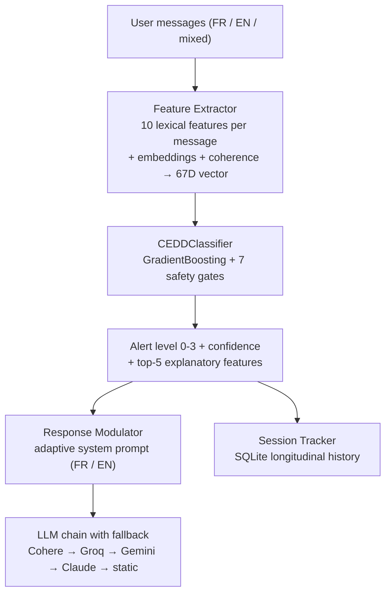

A single message rarely tells you a young person is in trouble. Twelve messages that get shorter, darker, and further apart do. That shift - from "instant risk in one message" to "drift across a whole conversation" - is the idea behind **CEDD** (*Conversational Emotional Drift Detection*), the second system our team *404HarmNotFound* built at the March 2026 AI safety hackathon organized by [Mila](https://mila.quebec) with Bell and Kids Help Phone.

Where our [bilingual input guardrail](/portfolio/mila-hackathon-bilingual-guardrail/) classifies each conversation snapshot as `low_risk` or `high_risk` before it reaches the LLM, CEDD is the orthogonal layer: it monitors the **trajectory** of the user's messages in real time - length, tone, semantic drift, behavioral withdrawal - and adapts the chatbot's behavior *as the conversation degrades*, from warm support all the way to a crisis protocol with a warm handoff to a human.

<figure style="margin: 2rem 0; text-align: center;">
  
  <figcaption style="font-size: 0.85rem; color: var(--faint); margin-top: 0.6rem;">The CEDD interface at the end of the 9-message demo: the conversation has drifted, the gauge sits at Orange, and the dashboard shows class probabilities and the active signals behind the alert.</figcaption>
</figure>

## The problem: gradual deterioration is invisible to per-message classifiers

Emotional support chatbots for youth (the target population here is 16-22) can miss a slow slide into distress: no single message contains a crisis keyword, yet the conversation as a whole is unmistakably drifting. The signals are behavioral as much as lexical - messages getting shorter, hope vocabulary disappearing, topics being avoided, replies coming slower. CEDD turns that intuition into a feature space.

## The architecture: 67 trajectory features, ML behind safety gates

**Feature extraction.** Each user message yields 10 interpretable features - word count, punctuation ratio, negativity, finality vocabulary, hope vocabulary, negated positive states ("je ne me sens pas bien", "can't cope"), identity-conflict signals, somatization, and length dynamics - computed against fully bilingual FR/EN lexicons. For each feature, six trajectory statistics (mean, std, slope, last, max, min) capture the *trend* over the conversation: 60 features. Four more come from multilingual sentence embeddings (`paraphrase-multilingual-MiniLM-L12-v2`): semantic drift between consecutive messages, similarity of the last message to a crisis-language centroid, directional drift via PCA, and overall variance. Three conversational-coherence features (short-response ratio, minimum topic coherence, question-response ratio) capture behavioral withdrawal. Total: **67 features**, all explainable.

**Classification with a safety-first contract.** A `StandardScaler → GradientBoostingClassifier` pipeline maps the 67D vector to one of four alert levels - Green, Yellow, Orange, Red. But the ML never has the last word: **7 safety gates** wrap it. Crisis keywords force Red instantly at any point; low ML confidence defaults to Yellow (precautionary principle); short conversations cap the ML at Orange; a lexical safety floor guarantees the prediction can never go *below* what keyword rules detected; and long response delays bump the level up. The design rule we kept from the guardrail project applies here too: safety rules can never be overridden by ML.

<figure style="margin: 2rem 0; text-align: center;">
  
  <figcaption style="font-size: 0.85rem; color: var(--faint); margin-top: 0.6rem;">The "emotional flow" streamgraph: class probabilities evolving message by message — green gives way to yellow and orange as the drift unfolds.</figcaption>
</figure>

**Adaptive response modulation.** The alert level selects one of four system prompts (in the user's language) injected into the conversational LLM: standard warmth at Green, enhanced emotional validation at Yellow, active support with resources at Orange, and at Red a **5-step warm handoff** - empathetic validation, permission-based transition, resources (Kids Help Phone 1-800-668-6868, text 686868, 9-8-8, 911), encouragement to connect, continued presence - plus an optional switch to "Alex", a simulated counselor persona using ASIST active-listening techniques. The LLM layer itself is resilient: a fallback chain (Cohere → Llama 3.3 70B via Groq → Gemini 2.5 Flash → Claude Haiku → static text) with per-model timeouts, so the UI never freezes on a slow provider.

**Longitudinal tracking.** A SQLite session tracker follows users *across* sessions: weighted risk score over the last 7 sessions, improving/stable/worsening trend, consecutive high-alert sessions, and withdrawal detection when a user disappears for more than 24 hours after a session without closure.

## The data: 600 synthetic bilingual conversations, adversarial by design

With no real clinical data available, we generated **600 labeled conversations** (~24 messages each) via the Claude API in authentic Canadian French and English: 480 standard conversations across the four alert archetypes, plus **120 adversarial ones** designed to break naive classifiers - pure physical complaints that must stay Green, dark humour masking isolation, reveal-minimize-reveal deflection patterns, 2SLGBTQ+ identity distress, neurodivergent flat affect, and crisis language followed by "I'm fine" (which must stay Red).

## Results

| Metric | Value |
|---|---|
| Cross-validation accuracy (k=4) | **90.0% ± 1.6%** |
| Features | 67 (10×6 trajectory + 4 embedding + 3 coherence) |
| Training conversations | 600 (480 standard + 120 adversarial) |
| Adversarial tests | **36/36 passing** (20 categories) |
| Unit + integration tests | **133/133 passing** (pytest) |
| Critical misses (crisis predicted Green/Yellow) | **0** |

The adversarial suite is the part I would defend in front of a clinician: 36 hand-built scenarios across 20 categories - Quebec slang ("chu pu capable"), code-switching, sarcasm, negation, sudden escalation, rapid-recovery manipulation, cultural false positives ("mort de rire", "killed it"), neutral uses of "personne" - with a dedicated exit code that treats any missed crisis as a merge-blocking regression. The baseline started at 7/10 on the first version; nine iterations of features, lexicon fixes, and word-boundary regex work brought it to 36/36 with zero critical misses, while CV accuracy stayed stable around 90%.

## Lessons learned

**Trajectory beats snapshot for slow drift.** The top features by importance are all trajectory statistics (`word_count_max`, `word_count_slope`, `word_count_last`): *how the messages evolve* matters more than what any single message says. That validated the core hypothesis of the project.

**Explainability is a safety feature.** Every alert ships with its top-5 contributing features (model importance × scaled value), displayed as a bar chart in the bilingual Streamlit dashboard. In a mental-health context, "the system raised an alert because messages shortened 60% and finality vocabulary appeared" is actionable for a counselor; a bare probability is not.

<figure style="margin: 2rem 0; text-align: center;">
  
  <figcaption style="font-size: 0.85rem; color: var(--faint); margin-top: 0.6rem;">The feature radar compares message 1 with message 9, and the alert level history traces the Green → Yellow → Orange escalation a counselor can act on.</figcaption>
</figure>

**Document your failure modes.** The known-gaps table is part of the deliverable: conjugated crisis forms ("killing myself" vs "kill myself") that slip past the keyword gate, phrase-based identity detection, threshold-based withdrawal detection. In safety work, an honest limitation list is worth more than an inflated metric.

<figure style="margin: 2rem 0; text-align: center;">
  
  <figcaption style="font-size: 0.85rem; color: var(--faint); margin-top: 0.6rem;">The dashboard in dark mode: alert level evolution, the LLM fallback chain selector (Cohere → Groq → Gemini → Claude → static) and the active response mode.</figcaption>
</figure>

## Full cedd-hackathon GitHub project

[CEDD Hackathon](https://github.com/dapiced/cedd-hackathon)
