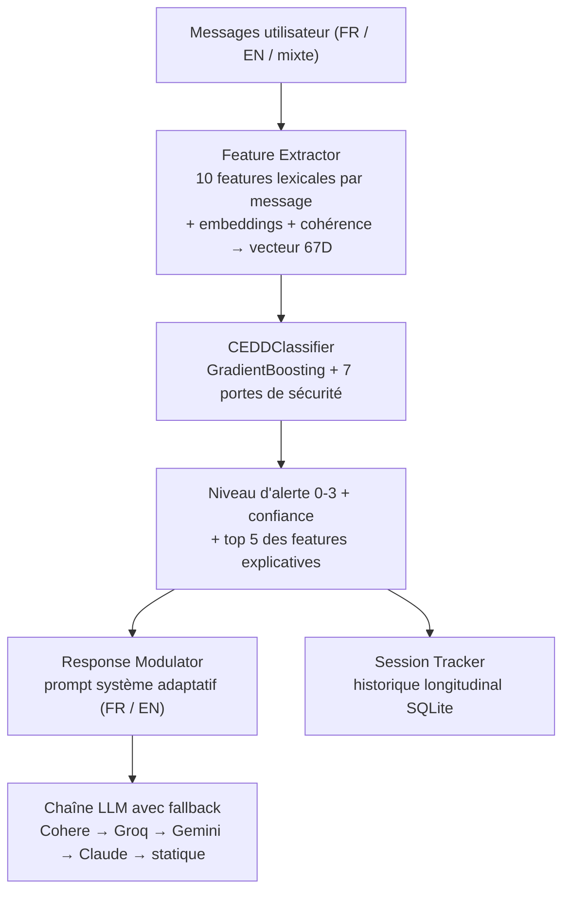

Un seul message dit rarement qu'un jeune va mal. Douze messages qui deviennent plus courts, plus sombres et plus espacés, oui. Ce déplacement - du « risque instantané dans un message » vers la « dérive sur l'ensemble d'une conversation » - est l'idée derrière **CEDD** (*Conversational Emotional Drift Detection*), le deuxième système que notre équipe *404HarmNotFound* a construit au hackathon sécurité de l'IA de mars 2026, organisé par [Mila](https://mila.quebec/fr) avec Bell et Jeunesse, J'écoute.

Là où notre [garde-fou d'entrée bilingue](/portfolio/hackathon-mila-garde-fou-bilingue/) classe chaque instantané de conversation en `low_risk` ou `high_risk` avant qu'il n'atteigne le LLM, CEDD est la couche orthogonale : il surveille en temps réel la **trajectoire** des messages de l'utilisateur - longueur, ton, dérive sémantique, retrait comportemental - et adapte le comportement du chatbot *au fur et à mesure que la conversation se dégrade*, du soutien chaleureux jusqu'au protocole de crise avec transfert accompagné vers un humain.

<figure style="margin: 2rem 0; text-align: center;">
  
  <figcaption style="font-size: 0.85rem; color: var(--faint); margin-top: 0.6rem;">L'interface CEDD à la fin de la démo de 9 messages (Félix, 18 ans, CÉGEP) : la conversation a dérivé, la jauge est à l'Orange, et le tableau de bord montre les probabilités par classe et les signaux actifs derrière l'alerte.</figcaption>
</figure>

## Le problème : la détérioration graduelle est invisible pour un classifieur par message

Les chatbots de soutien émotionnel pour les jeunes (la population cible ici : 16-22 ans) peuvent manquer un glissement lent vers la détresse : aucun message pris isolément ne contient de mot-clé de crise, et pourtant la conversation dans son ensemble dérive de façon manifeste. Les signaux sont autant comportementaux que lexicaux - des messages qui raccourcissent, le vocabulaire d'espoir qui disparaît, des sujets évités, des réponses qui tardent. CEDD transforme cette intuition en espace de features.

## L'architecture : 67 features de trajectoire, le ML derrière des portes de sécurité

**Extraction de features.** Chaque message utilisateur produit 10 features interprétables - nombre de mots, ratio de ponctuation, négativité, vocabulaire de finalité, vocabulaire d'espoir, états positifs niés (« je ne me sens pas bien », « can't cope »), signaux de conflit identitaire, somatisation, dynamique de longueur - calculées sur des lexiques entièrement bilingues FR/EN. Pour chaque feature, six statistiques de trajectoire (moyenne, écart-type, pente, dernière valeur, max, min) capturent la *tendance* sur la conversation : 60 features. Quatre autres proviennent d'embeddings de phrases multilingues (`paraphrase-multilingual-MiniLM-L12-v2`) : dérive sémantique entre messages consécutifs, similarité du dernier message avec un centroïde de langage de crise, dérive directionnelle par PCA, et variance globale. Trois features de cohérence conversationnelle (ratio de réponses courtes, cohérence thématique minimale, taux de réponse aux questions) capturent le retrait comportemental. Total : **67 features**, toutes explicables.

**Une classification sous contrat de sécurité.** Un pipeline `StandardScaler → GradientBoostingClassifier` projette le vecteur 67D sur quatre niveaux d'alerte - Vert, Jaune, Orange, Rouge. Mais le ML n'a jamais le dernier mot : **7 portes de sécurité** l'encadrent. Un mot-clé de crise force le Rouge instantanément à tout moment ; une confiance ML faible retombe par défaut sur Jaune (principe de précaution) ; les conversations courtes plafonnent le ML à Orange ; un plancher de sécurité lexical garantit que la prédiction ne peut jamais descendre *sous* ce que les règles à mots-clés ont détecté ; et un long délai de réponse fait monter le niveau d'un cran. La règle de conception héritée du projet garde-fou s'applique ici aussi : les règles de sécurité ne peuvent jamais être outrepassées par le ML.

<figure style="margin: 2rem 0; text-align: center;">
  
  <figcaption style="font-size: 0.85rem; color: var(--faint); margin-top: 0.6rem;">Le streamgraph du « flux émotionnel » : les probabilités par classe évoluent message par message — le vert cède la place au jaune puis à l'orange au fil de la dérive.</figcaption>
</figure>

**Modulation adaptative de la réponse.** Le niveau d'alerte sélectionne l'un des quatre prompts système (dans la langue de l'utilisateur) injectés dans le LLM conversationnel : chaleur standard au Vert, validation émotionnelle renforcée au Jaune, soutien actif avec ressources à l'Orange, et au Rouge un **transfert accompagné en 5 étapes** - validation empathique, transition avec demande de permission, présentation des ressources (Jeunesse, J'écoute 1-800-668-6868, texto 686868, 9-8-8, 911), encouragement à se connecter, présence continue - plus une bascule optionnelle vers « Alex », un·e intervenant·e simulé·e utilisant les techniques d'écoute active ASIST. La couche LLM elle-même est résiliente : une chaîne de fallback (Cohere → Llama 3.3 70B via Groq → Gemini 2.5 Flash → Claude Haiku → texte statique) avec timeout par modèle, pour que l'interface ne gèle jamais sur un fournisseur lent.

**Suivi longitudinal.** Un session tracker SQLite suit les utilisateurs *entre* les sessions : score de risque pondéré sur les 7 dernières sessions, tendance (amélioration / stable / aggravation), sessions consécutives à niveau élevé, et détection de retrait quand un utilisateur disparaît plus de 24 heures après une session restée sans clôture.

## Les données : 600 conversations synthétiques bilingues, adversariales par conception

Sans données cliniques réelles disponibles, nous avons généré **600 conversations étiquetées** (~24 messages chacune) via l'API Claude, en français canadien et en anglais authentiques : 480 conversations standard couvrant les quatre archétypes d'alerte, plus **120 adversariales** conçues pour piéger les classifieurs naïfs - plaintes purement physiques qui doivent rester Vertes, humour noir masquant l'isolement, patterns de révélation-minimisation, détresse identitaire 2SLGBTQ+, affect plat neurodivergent, et langage de crise suivi d'un « ça va, je vais bien » (qui doit rester Rouge).

## Résultats

| Métrique | Valeur |
|---|---|
| Précision en validation croisée (k=4) | **90,0 % ± 1,6 %** |
| Features | 67 (10×6 trajectoire + 4 embedding + 3 cohérence) |
| Conversations d'entraînement | 600 (480 standard + 120 adversariales) |
| Tests adversariaux | **36/36 réussis** (20 catégories) |
| Tests unitaires + intégration | **133/133 réussis** (pytest) |
| Crises manquées (crise prédite Vert/Jaune) | **0** |

La suite adversariale est la partie que je défendrais devant un clinicien : 36 scénarios construits à la main dans 20 catégories - joual québécois (« chu pu capable »), alternance de langues, sarcasme, négation, escalade soudaine, manipulation par « récupération rapide », faux positifs culturels (« mort de rire », « killed it »), usages neutres de « personne » - avec un code de sortie dédié qui traite toute crise manquée comme une régression bloquante. La première version partait de 7/10 ; neuf itérations de features, de corrections de lexiques et de regex à frontières de mots l'ont amenée à 36/36 sans aucune crise manquée, avec une précision CV stable autour de 90 %.

## Leçons apprises

**La trajectoire bat l'instantané pour la dérive lente.** Les features les plus importantes du modèle sont toutes des statistiques de trajectoire (`word_count_max`, `word_count_slope`, `word_count_last`) : *comment les messages évoluent* compte plus que ce que dit n'importe quel message isolé. C'est la validation de l'hypothèse centrale du projet.

**L'explicabilité est une fonctionnalité de sécurité.** Chaque alerte est livrée avec son top 5 de features contributives (importance du modèle × valeur normalisée), affiché en barres dans le tableau de bord Streamlit bilingue. En contexte de santé mentale, « le système a levé une alerte parce que les messages ont raccourci de 60 % et que le vocabulaire de finalité est apparu » est actionnable pour un intervenant ; une probabilité nue ne l'est pas.

<figure style="margin: 2rem 0; text-align: center;">
  
  <figcaption style="font-size: 0.85rem; color: var(--faint); margin-top: 0.6rem;">Le radar des features compare le message 1 au message 9, et l'historique des niveaux d'alerte trace l'escalade Vert → Jaune → Orange sur laquelle un intervenant peut agir.</figcaption>
</figure>

**Documenter ses modes de défaillance.** Le tableau des lacunes connues fait partie du livrable : formes de crise conjuguées (« killing myself » vs « kill myself ») qui échappent à la porte à mots-clés, détection identitaire par phrases plutôt que par contexte, détection de retrait par seuil. En sécurité, une liste de limites honnête vaut plus qu'une métrique gonflée.

<figure style="margin: 2rem 0; text-align: center;">
  
  <figcaption style="font-size: 0.85rem; color: var(--faint); margin-top: 0.6rem;">L'interface en mode sombre : chaque réponse du bot porte son badge de niveau d'alerte, et les ressources de Jeunesse, J'écoute apparaissent dès l'Orange.</figcaption>
</figure>

## Projet Github cedd-hackathon complet

[CEDD Hackathon](https://github.com/dapiced/cedd-hackathon)
