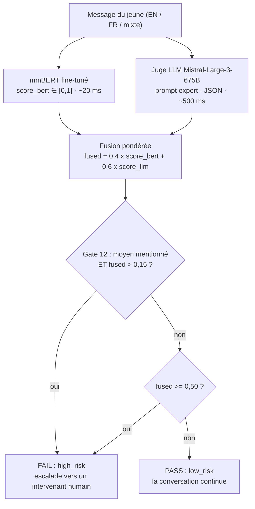
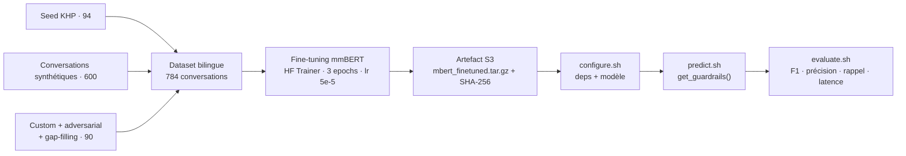

« j'suis pu capable... j'veux juste que ça arrête. »

Neuf mots, en français québécois, tapés par un adolescent à un assistant virtuel. Un système d'IA dispose d'environ une seconde pour trancher : fatigue ordinaire, ou signal de crise exigeant l'intervention d'un humain ? C'est le problème que notre équipe a attaqué en mars 2026 au premier hackathon « sécurité de l'IA » de [Mila](https://mila.quebec/fr/nouvelle/mila-lance-son-premier-hackathon-securite-de-ia-contexte-sante-mentale), l'Institut québécois d'intelligence artificielle.

Au sein de l'équipe 021 - *404HarmNotFound* - j'ai principalement porté le pipeline de données bilingue (dont 600 conversations synthétiques), le fine-tuning du classifieur mmBERT et le harnais d'expérimentation qui nous a permis de tester plus de 30 configurations en deux jours. Résultat : **F1 = 0,876** sur le jeu d'évaluation caché et une place dans le **top 15 sur 80 équipes**.

## Le contexte : sécuriser un assistant virtuel pour Jeunesse, J'écoute

Organisé par Mila avec Bell et Kids Help Phone (Jeunesse, J'écoute), le hackathon visait un système bien réel : l'assistant virtuel de KHP. Premier volet, *red team* : stress-tester le chatbot - nos 1 440 tests ont révélé que 77,6 % des cas critiques ne recevaient aucune ressource de crise. Second volet, *blue team* et cœur du projet : construire un **garde-fou d'entrée** (*input guardrail*), un classifieur qui étiquette chaque conversation `low_risk` ou `high_risk` **avant** qu'elle n'atteigne le LLM conversationnel, pour escalader les cas à risque vers un intervenant humain. Contraintes : modèles hébergés sur les GPU du hackathon (A40), aucune API externe à l'exécution, budget de latence strict.

## La problématique et les données

Deux difficultés dominent ce type de classification. La première est l'**asymétrie des erreurs** : un faux négatif (crise manquée) laisse un jeune en danger sans escalade ; un faux positif crée de la friction et de la fatigue d'alerte chez les intervenants. On optimise donc le rappel d'abord, la précision ensuite. La seconde est la **langue** : les signaux de crise sont souvent indirects (« tout le monde serait mieux sans moi »), euphémiques (« dormir pour toujours »), en argot jeunesse (« unalive », « kms ») ou en français québécois, quand ils n'alternent pas entre les deux langues au fil d'une conversation multi-tours.

Nous avons assemblé un jeu d'entraînement de **784 conversations bilingues** (3 à 35 tours, 13,4 en moyenne) : 94 conversations *seed* annotées par KHP, 35 cas construits à la main, 600 conversations synthétiques générées via l'API Claude par le script de pipeline Python (300 EN + 300 FR, 4 paliers de risque projetés en binaire), 36 cas adversariaux (sarcasme, négation, code-switching) et 19 conversations comblant les trous de taxonomie. Au total : 53,7 % `high_risk` ; 414 conversations en anglais, 352 en français, 18 mixtes. Le principe directeur de l'annotation : **le sujet n'est pas le risque** - une conversation sur le suicide peut être `low_risk` (recherche scolaire), un stress d'école peut être `high_risk` (effondrement fonctionnel). Le jeu couvre explicitement des scénarios 2ELGBTQ+, autochtones, nouveaux arrivants, neurodivergents et jeunes en famille d'accueil.

## L'architecture : pourquoi deux modèles plutôt qu'un

Notre solution fusionne deux modèles complémentaires - la seule approche hybride parmi les équipes de tête.

**mmBERT, l'encodeur multilingue fine-tuné.** [jhu-clsp/mmBERT-base](https://huggingface.co/jhu-clsp/mmBERT-base) est un encodeur ModernBERT (2025) de 140 M de paramètres : embeddings positionnels RoPE, attention locale/globale alternée, flash-attention, et surtout un support natif FR/EN. Un *encodeur* transforme le texte en un vecteur de 768 dimensions qui capture son sens ; nous avons ajouté une tête de classification binaire par-dessus, puis fine-tuné l'ensemble sur nos 784 conversations :

```python
model = AutoModelForSequenceClassification.from_pretrained(
    "jhu-clsp/mmBERT-base", num_labels=2,
    id2label={0: "low_risk", 1: "high_risk"},
)
```

Il produit `score_bert` ∈ [0,1] en ~20 ms sur GPU - rapide, déterministe, local.

**Mistral, le juge LLM.** Un Mistral-Large-3-675B (quantifié NVFP4, hébergé sur l'infrastructure du hackathon) note la même conversation en *zéro-shot* (sans fine-tuning), guidé par un prompt expert - 8 signaux `high_risk` (dont le désespoir passif avec effondrement fonctionnel), 10 critères `low_risk`, 8 règles critiques (« déni + détresse = high risk », expressions québécoises) et 11 exemples few-shot bilingues. Température 0, sortie JSON contrainte `{"high_risk": bool, "score": 0.0-1.0}`, parsing robuste avec retry. Il produit `score_llm` en ~500 ms.

**La fusion tardive pondérée.** Plutôt qu'un vote binaire, nous combinons les scores continus, avec un filet de sécurité par règle clinique - la « Gate 12 » déclenche l'escalade dès qu'un moyen de passage à l'acte est mentionné (pilules, corde, pont…, en deux langues) accompagné d'un minimum de détresse :

```python
fused = 0.4 * score_bert + 0.6 * score_llm
if any(term in text for term in METHOD_TERMS) and fused > 0.15:
    return FAIL                      # Gate 12 : override clinique
return FAIL if fused >= 0.50 else PASS
```

Pourquoi l'hybride ? Chaque modèle seul plafonne : mmBERT capte les patterns lexicaux mais rate le langage indirect (F1 = 0,818) ; Mistral capte la sémantique mais se montre trop conservateur (F1 = 0,833). La fusion atteint **0,876** - meilleure que chacun. Autre atout, opérationnel : si l'API LLM tombe, le système bascule automatiquement sur mmBERT seul (dégradation gracieuse), et le classifieur local préserve la vie privée.

## Le pipeline de bout en bout



À l'inférence : la conversation est nettoyée puis tokenisée pour mmBERT (512 tokens max), les deux modèles la notent en parallèle, la fusion tranche, la Gate 12 peut court-circuiter le seuil. Point important de design : une classification `high_risk` ne coupe jamais la conversation - elle déclenche un transfert chaleureux vers un humain, car une déconnexion brutale aggrave la détresse.

Côté entraînement et évaluation, le flux est entièrement reproductible :



## Entraînement et optimisation

Le fine-tuning utilise le Trainer de Hugging Face, sans gel de couches (le modèle est assez petit pour un fine-tuning complet) : 3 époques, batch de 8, learning rate 5e-5 avec warmup linéaire (ratio 0,1), weight decay 0,01, AdamW, cross-entropy, split 80/20 (seed 42), sélection du meilleur checkpoint au F1. La tokenisation aligne chaque conversation sur la limite du modèle :

```python
enc = tokenizer(texts, truncation=True, max_length=512, padding="max_length")
```

Le bilinguisme est géré nativement par le tokenizer multilingue - aucun modèle séparé par langue. Contre-intuitif mais instructif : nous avons tenté cinq ré-entraînements avec des jeux élargis (890, 1 037, 1 131 exemples) et d'autres encodeurs (XLM-R, mDeBERTa) - **tous ont dégradé le score** sur le jeu caché. La qualité et l'alignement des données battent leur quantité.

## Résultats et évaluation

Métriques sur le jeu d'évaluation caché (102 conversations, jamais vues) - rappel des définitions : la *précision* mesure la fiabilité des alertes, le *rappel* la fraction des vraies crises détectées, le *F1* leur moyenne harmonique :

| Approche | Précision | Rappel | F1 | Latence |
|---|---|---|---|---|
| mmBERT seul (fine-tuné) | 0,806 | 0,831 | 0,818 | ~27 ms |
| Mistral seul (juge LLM) | 0,821 | 0,846 | 0,833 | ~500 ms |
| OR-stacking (votes binaires) | 0,689 | 1,000 | 0,810 | ~1 744 ms |
| Cascade (mmBERT décide les cas clairs) | 0,814 | 0,877 | 0,844 | ~926 ms |
| Fusion pondérée 0,4/0,6 | 0,853 | 0,892 | 0,872 | ~1 657 ms |
| **Fusion + Gate 12 (final)** | **0,833** | **0,923** | **0,876** | **~1 000 ms** |

Un rappel de 92,3 % signifie qu'environ 60 des 65 conversations à haut risque sont correctement escaladées, avec une précision qui garde la fatigue d'alerte sous contrôle. La robustesse bilingue a été vérifiée sur entrées EN, FR et mixtes - euphémismes, slang et code-switching compris. Ce score nous a placés dans le **top 15 sur 80 équipes** (8ᵉ au classement automatisé F1).

## Défis rencontrés et leçons apprises

**La fuite de données rend la validation locale trompeuse.** Le jeu *seed* fourni faisait partie de nos données d'entraînement : nos métriques locales surestimaient systématiquement la performance réelle. Leçon : ne prendre aucune décision d'architecture sans évaluation sur des données réellement inconnues.

**Simple bat complexe.** Seuils adaptatifs, méta-apprenants, poids dynamiques, chaîne de pensée : chaque ajout de complexité a dégradé le score caché. Les poids statiques 0,4/0,6 trouvés par grid search sur held-out ont tenu. Sur 12 gates cliniques testées, une seule (méthode/moyen - le signal le plus fort de la littérature en prévention du suicide) a survécu.

**Le prompt est un équilibre fragile.** Ajouter ou retirer un seul exemple few-shot faisait bouger le F1 de ±0,01. Les équipes devant nous utilisaient les mêmes LLM - leur avantage tenait à la calibration du prompt, pas à l'architecture. Le *prompt engineering* rigoureux est un levier au même titre que le choix du modèle.

## Conclusion et takeaways

Ce projet condense ce que j'aime dans l'ingénierie ML appliquée : un cycle complet - données, fine-tuning, fusion, évaluation - sous contraintes réelles de latence, de résilience et d'éthique, avec une discipline MLOps de bout en bout (artefacts S3 vérifiés par SHA-256, évaluation reproductible, seeds fixés). Il illustre aussi qu'en sécurité de l'IA, le coût d'une erreur n'est pas symétrique : concevoir pour le rappel est un choix moral autant que technique. Prochaines pistes : distiller le juge Mistral dans un encodeur plus gros pour réduire la latence, calibrer les scores (Platt / temperature scaling), encoder la structure multi-tours, et auditer l'équité par sous-groupe DEI.
