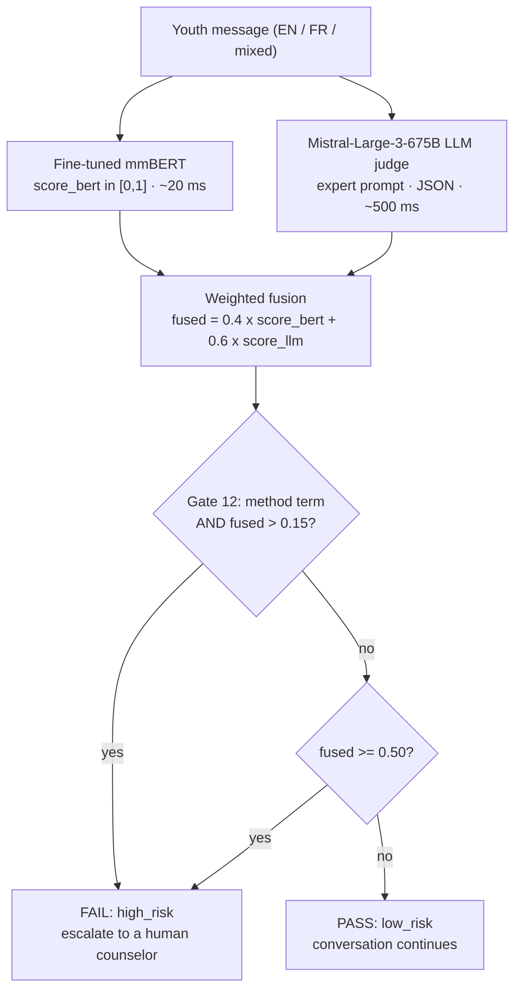
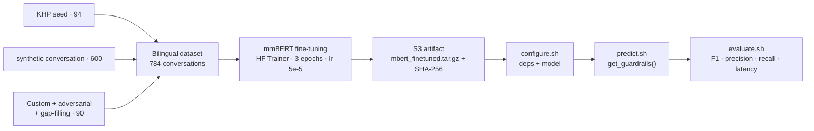

« j'suis pu capable... j'veux juste que ça arrête. »

Nine words of Quebec French — *"I can't take it anymore... I just want it to stop"* — typed by a teenager to a virtual assistant. An AI system has about one second to decide: ordinary exhaustion, or a crisis signal that demands a human? That is the problem our team took on in March 2026 at the first AI safety hackathon hosted by [Mila](https://mila.quebec/fr/nouvelle/mila-lance-son-premier-hackathon-securite-de-ia-contexte-sante-mentale), the Quebec AI Institute.

On team 021 — *404HarmNotFound* — I mainly owned the bilingual data pipeline (including 600 synthetic conversations), the fine-tuning of the mmBERT classifier, and the experimentation harness that let us test 30+ configurations in two days. The outcome: **F1 = 0.876** on the hidden evaluation set and a finish in the **top 15 out of 80 teams**.

## The context: securing a virtual assistant for Kids Help Phone

Organized by Mila with Bell and Kids Help Phone, the hackathon targeted a very real system: KHP's virtual assistant, which supports youth in distress. The challenge had two parts. First, a *red team* track: stress-test the chatbot and document its failure modes — we ran 1,440 tests and found, among other things, that 77.6% of critical cases received no crisis resources at all. Second, the *blue team* track and the heart of the project: build an **input guardrail** — a classifier that labels every conversation `low_risk` or `high_risk` **before** it reaches the conversational LLM, so that at-risk cases are escalated to a human counselor. Hard constraints: models had to run on the hackathon's GPU environment (A40), no external APIs at inference time, and a strict latency budget.

## The problem and the data

Two difficulties dominate this kind of classification. The first is **error asymmetry**: a false negative (a missed crisis) leaves a young person in danger with no escalation; a false positive creates friction and alert fatigue for counselors. So you optimize recall first, precision second. The second is **language**: crisis signals are often indirect ("everyone would be better off without me"), euphemistic ("sleep forever"), phrased in youth slang ("unalive", "kms"), in Quebec French ("ça va pas pantoute"), or code-switched between French and English within a single multi-turn conversation.

We assembled a training set of **784 bilingual conversations** (3 to 35 turns, 13.4 on average): 94 KHP-annotated *seed* conversations, 35 hand-crafted cases, 600 synthetic conversations generated through the Claude API by the python pipeline script (4 risk tiers mapped to binary labels, perfectly bilingual: 300 EN + 300 FR), 36 adversarial edge cases (sarcasm, negation, code-switching), and 19 conversations filling taxonomy gaps. Distribution: 53.7% `high_risk`, 46.3% `low_risk`; 414 conversations in English, 352 in French, 18 mixed. The guiding annotation principle: **topic is not risk** — a conversation about suicide can be `low_risk` (a school research project), while school stress can be `high_risk` (functional collapse). The dataset explicitly covers 2SLGBTQ+, Indigenous, newcomer, neurodivergent, and foster-care scenarios.

## The architecture: why two models instead of one

Our solution fuses two complementary models — the only hybrid approach among the top teams.

**mmBERT, the fine-tuned multilingual encoder.** [jhu-clsp/mmBERT-base](https://huggingface.co/jhu-clsp/mmBERT-base) is a 140M-parameter ModernBERT encoder (2025): RoPE positional embeddings, alternating local/global attention, flash attention, and — crucially — native French/English support. An *encoder* turns text into a 768-dimensional vector that captures its meaning; we added a binary classification head on top and fine-tuned the whole model on our 784 conversations:

```python
model = AutoModelForSequenceClassification.from_pretrained(
    "jhu-clsp/mmBERT-base", num_labels=2,
    id2label={0: "low_risk", 1: "high_risk"},
)
```

It outputs `score_bert` ∈ [0,1] in ~20 ms on GPU — fast, deterministic, and local.

**Mistral, the LLM judge.** A Mistral-Large-3-675B (NVFP4-quantized, hosted on the hackathon infrastructure) scores the same conversation *zero-shot*: no fine-tuning, but a carefully engineered expert prompt — 8 `high_risk` signals (including passive hopelessness with functional collapse), 10 `low_risk` criteria, 8 critical rules ("denial + distress IS high risk", Quebec French expressions), and 11 bilingual few-shot examples. Temperature 0, constrained JSON output `{"high_risk": bool, "score": 0.0-1.0}`, robust parsing with retries. It outputs `score_llm` in ~500 ms.

**Late weighted fusion.** Instead of a binary vote, we combine the continuous scores, with a rule-based clinical safety net — "Gate 12" forces escalation whenever a method or means is mentioned (pills, rope, bridge…, in both languages) together with any baseline distress:

```python
fused = 0.4 * score_bert + 0.6 * score_llm
if any(term in text for term in METHOD_TERMS) and fused > 0.15:
    return FAIL                      # Gate 12: clinical override
return FAIL if fused >= 0.50 else PASS
```

Why hybrid? Each model plateaus alone: mmBERT captures lexical patterns but misses indirect language (F1 = 0.818); Mistral captures semantics but is too conservative (F1 = 0.833). The fusion reaches **0.876** — better than either. It also brings operational properties: if the LLM API goes down, the system automatically degrades to mmBERT alone, and the local classifier keeps sensitive data on the server.

## The end-to-end pipeline



At inference time: the conversation is cleaned and tokenized for mmBERT (512-token limit), both models score it, the fusion decides, and Gate 12 can bypass the threshold entirely. One deliberate design choice: a `high_risk` classification never cuts the conversation off — it triggers a warm handoff to a human, because an abrupt disconnection can deepen distress.

The training and evaluation flow is fully reproducible:



## Training and optimization

Fine-tuning uses the Hugging Face Trainer, with no layer freezing (the model is small enough for full fine-tuning): 3 epochs, batch size 8, learning rate 5e-5 with linear warmup (ratio 0.1), weight decay 0.01, AdamW, cross-entropy loss, an 80/20 split (seed 42), and best-checkpoint selection on F1. Tokenization aligns every conversation to the model's limit:

```python
enc = tokenizer(texts, truncation=True, max_length=512, padding="max_length")
```

Bilingualism is handled natively by the multilingual tokenizer — no separate per-language models. Counter-intuitive but instructive: we attempted five retraining runs with larger datasets (890, 1,037, 1,131 examples) and alternative encoders (XLM-R, mDeBERTa) — **every one of them scored worse** on the hidden set. The original 784 conversations, better aligned with the evaluation distribution, won: data quality beats data quantity.

## Results and evaluation

Metrics on the hidden evaluation set (102 never-seen conversations) — quick definitions: *precision* measures how trustworthy the alerts are, *recall* the fraction of true crises caught, *F1* their harmonic mean:

| Approach | Precision | Recall | F1 | Latency |
|---|---|---|---|---|
| mmBERT alone (fine-tuned) | 0.806 | 0.831 | 0.818 | ~27 ms |
| Mistral alone (LLM judge) | 0.821 | 0.846 | 0.833 | ~500 ms |
| OR-stacking (binary votes) | 0.689 | 1.000 | 0.810 | ~1,744 ms |
| Cascade (mmBERT decides clear cases) | 0.814 | 0.877 | 0.844 | ~926 ms |
| Weighted fusion 0.4/0.6 | 0.853 | 0.892 | 0.872 | ~1,657 ms |
| **Fusion + Gate 12 (final)** | **0.833** | **0.923** | **0.876** | **~1,000 ms** |

A recall of 92.3% means roughly 60 of the 65 high-risk conversations are correctly escalated, with precision high enough to keep alert fatigue manageable. Bilingual robustness was verified on English, French, and mixed inputs, including euphemisms, slang, and code-switching. This score placed us in the **top 15 out of 80 teams** (8th on the automated F1 leaderboard).

## Challenges and lessons learned

**Data leakage makes local validation misleading.** The provided *seed* set was part of our training data, so our local metrics systematically overestimated real performance. Lesson: detect leakage early, and never make an architecture decision without evaluating on genuinely unseen data.

**Simple beats complex.** Adaptive thresholds, meta-learners, dynamic weights, chain-of-thought prompting: every added layer of complexity degraded the hidden-set score. The static 0.4/0.6 weights found by grid search on held-out data held up. Of 12 clinical gates we tested, only one survived — method/means detection, the strongest signal in the suicide-prevention literature.

**Prompts are a fragile equilibrium.** Adding or removing a single few-shot example moved F1 by ±0.01. The teams ahead of us used the same LLMs — their edge was prompt calibration, not architecture. Rigorous *prompt engineering* is a lever on par with model choice.

## Conclusion and takeaways

This project condenses what I enjoy most in applied ML engineering: a complete cycle — data, fine-tuning, fusion, evaluation — under real constraints of latency, resilience, and ethics, with end-to-end MLOps discipline (versioned artifacts on S3 with SHA-256 verification, a reproducible evaluation pipeline, fixed seeds). It also illustrates that in AI safety the cost of an error is not symmetric: designing for recall is a moral choice as much as a technical one. Next steps worth exploring: distilling the Mistral judge into a larger encoder to cut latency, score calibration (Platt / temperature scaling), encoding multi-turn structure, and per-subgroup fairness audits across DEI slices.