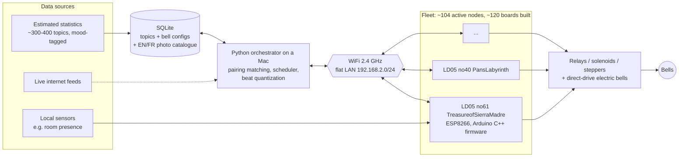
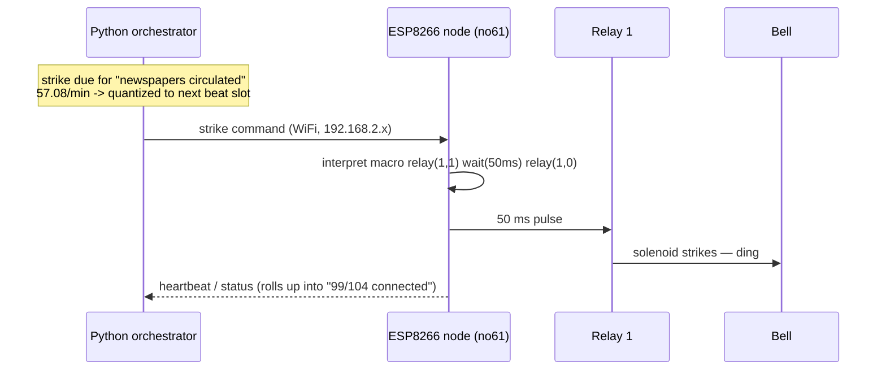

```text
2026-07-17T14:32:11Z  event=star_ignited        scope=universe   rate=411e6/day
2026-07-17T14:32:11Z  event=video_uploaded      scope=youtube    rate=2.6e3/min
2026-07-17T14:32:12Z  event=pothole_repaired    scope=montreal   rate=18.3/hr
2026-07-17T14:32:57Z  event=human_died          cause=suicide    rate=1.3/min
```

The world emits events. It has always emitted events; births, deaths, supernovae, package deliveries at rates we mostly consume through dashboards, if we consume them at all. A number in a report has no mass. It doesn't displace air.

In a dark room in Old Montreal, somebody built a different kind of consumer for that stream. A hundred reclaimed bells; ship bells, cowbells, fire alarms, a schoolhouse bell pulled off a demolition pile, each wired to its own microcontroller, each subscribed to one topic of the world's event bus, each ringing at the real measured rate. A gong sounds every 46 seconds. The placard reads: *Suicide (Worldwide) - 1 per ring - 1.3 rings per minute*. You do the division in your head and go quiet 😶.

I went to see an art installation. I found a production-grade distributed system, and I did what 25 years of infrastructure work have trained me to do: I read every label, photographed every exposed board, and reconstructed the architecture. Consider this a field note from someone else's machine room.


*[Databells](https://www.databells.ca/), by Ottawa artist Rich Loen (a former programmer - it shows), at the [Salon des Bananes](https://www.salondesbananes.com/), 220 Saint-Paul St W. Until August 16, 2026, daily 12-8 pm, free. Photo: me.*

**Method, before anything else.** Every claim below traces to one of three sources: my own on-site observations and photos, the artist's [official documentary](https://www.youtube.com/watch?v=OTikIqsn9X0), or press coverage (all linked at the bottom). Some Passages are my own inferences, consistent with the evidence, unconfirmed by the team. In this house we label our confidence levels.

## 1. The data layer: 300-400 topics, each with a mood and a decimation factor

Start where every honest system diagram starts: the data. Per the documentary, the corpus is **300 to 400 curated sources**, assembled over years by dedicated data researchers. Two ingestion patterns: **batch** (estimated statistics; mortality, production, astronomy, refreshed as the research updates) and **streaming** (live internet feeds the server ties into). Plus one source class nobody writes about, which I'll get to, because it ingests *you*.

Every source carries two fields that drive the whole machine:

**`mood`.** Sources are emotionally classified; happy, sad, scary, and so is every bell. The assignment layer enforces compatibility: mortality data will never be scheduled onto the joke bell labeled "Ring for a BEER." This isn't curatorial hand-waving; on the control software I photographed, `Mood: Happy(1)` is a literal enum in a config dialog.

**The scale factor or, as we'd call it in signal processing, the decimation rate.** A bell is an actuator with a hard mechanical ceiling: the fleet enforces `Min Ring Interval: 1000 ms`, a 1 Hz Nyquist-style limit on the physical layer. TikTok does not respect a 1 Hz budget. So every assignment downsamples: *k* events per ring, chosen so the scaled rate fits the bell's envelope. Reality gets decimated until it's playable:

| Some topic (from the placards) | Decimation | Rendered rate |
|---|---|---|
| Suicide (worldwide) | 1 / ring | 1.3 / min |
| Supernova occurs (observable universe) | 1,000 / ring | 1.8 / min |
| New star is born (observable universe) | 1,000,000 / ring | 411 / day |
| Voyager 1 distance travelled | 1,000 km / ring | 1.025 / min |
| Videos viewed on TikTok | 100,000 / ring | 7 / min |
| Videos uploaded to YouTube | 1,000 / ring | 2.6 / min |
| City of Montreal repairs a pothole | 1 / ring | 18.3 / hour |
| New millionaires (worldwide) | 1 / ring | 5,000,000 / year |


*The decimation factor, printed in black and white. The small index in the corner is the bell's primary key.*

### QA pass: I validated an art installation's dataset

Never trust a dataset you haven't profiled. So, standing in the gallery, I ran spot checks:

```text
Voyager 1:    1,000 km/ring × 1.025 rings/min = 1,025 km/min ≈ 17.1 km/s
              → matches the probe's actual heliocentric speed.        PASS

Supernovae:   1.8 rings/min × 1,000/ring = 1,800/min = 30/s
              → the standard observable-universe estimate.            PASS

Suicides:     1.3/min ≈ 683,000/yr
              → WHO's published order of magnitude (~700k).           PASS

Internal:     "57.077626/min (30,000,000/yr) — 1051 ms between rings"
              57.077626 × 525,600 min/yr = 30.0M ✓ ; 60,000/57.08 = 1051 ms ✓
              → the math shown in the software's own UI is self-consistent. PASS
```

That last line was photographed straight off the control screen, the software *shows its work*, converting an annual volume to a per-minute rate to an inter-ring interval, live. A data pipeline that exposes its unit conversions in the UI has my whole heart.


*1,000 km per ring. The fastest bell in the solar system.*

## 2. The math nobody printed on the placards

Here's where my Data Science coursework started ringing, literally.

**These are Poisson-distribution processes.** Worldwide aggregate events; deaths, uploads, star births, are the textbook case: large numbers of independent low-probability occurrences, arriving at an average rate λ, with exponentially distributed inter-arrival times, E[T] = 1/λ. The suicide gong's λ = 1.3/min gives E[T] ≈ 46 s, which is exactly the number your gut computes, uncomfortably, while you stand there.

**But the installation doesn't render the process, it renders the expectation.** A faithful Poisson rendition would be bursty: clusters, then silence, memorylessly. Databells instead rings each bell at the *mean* rate, on a regular interval. It's a deliberate estimator choice: render E[X], discard the variance. And then it reintroduces stochasticity one layer up, the bell source assignment is semi-random and periodically reshuffled, so the *composition* varies while each voice stays metronomic. Randomness management in three tiers: deterministic per-bell rates, stochastic assignment (probabilist), and (next section) musical quantization. I've reviewed production systems with less thoughtful variance budgets.

**Superposition, audible.** Independent Poisson processes sum: the room's total ring rate is Σλᵢ across ~100 bells. You don't hear a hundred statistics; you hear one aggregate process, civilization's combined event rate with the fast topics laying down the groove and the rare ones landing accents. The genre precedent is the Geiger counter, the original event-rate sonification: clicks per minute as intensity. **Databells is a Geiger counter for civilization.**

**And the assignment layer is a pairing matching problem.** Two vertex sets, bells B, sources S with an edge (b, s) permitted iff `mood(b) == mood(s)` and `λ_s / k_s ≤ rate_max(b)`. The scheduler samples a matching from the feasible set. My discrete-math course promised pairing graphs would show up in real life; I did not expect them to show up in bronze. (The constraint formulation is mine; the mood and rate-capability fields it's built from are photographed fact.)

Why does a bell even have a `rate_max`? Acoustics. Per the documentary, a massive bell needs time to *decay*, ring it again too soon and you smear its voice. The mechanical rate limit is an acoustic constraint stored per-bell in the database. Physical-layer backpressure, defined by resonance.

## 3. Architecture, from orbit

Everything below is anchored to a photo or a primary source.





End to end: an annual statistic lands in SQLite → the orchestrator normalizes it to a rate → constrained matching pairs it with a compatible bell → the scheduler lays every strike onto a musical grid → a command crosses the WiFi LAN → firmware interprets a macro → a relay pulses for 50 ms → a solenoid strikes bronze → an event that happened somewhere on Earth becomes a pressure wave in Old Montreal. Ingestion to delivery, with a sound wave as the sink and an emotion as the dashboard.

## 4. The node: LD05, or how a supply-chain crisis chose the silicon

Each bell gets a dedicated controller: the custom **LD05** board, designed by the artist's brother (an electronics builder) and hand-assembled in a run of **~120 units**, a hundred deployed, the rest spares. That spare pool neatly explains a forensic detail from my photos: bell IDs run past 111 while the fleet counter shows 104.


*LD05 rev 02, dated 2022-10-18. MAC + hostname + static IP on the label, banana in the silkscreen.*

| Element | Read directly off the board |
|---|---|
| MCU | Socketed **NodeMCU ESP8266** (Tensilica Xtensa L106 core, 802.11 b/g/n, 2.4 GHz only) - swappable in 30 seconds |
| Power | 8–28 VDC, center positive; 3 barrel jacks + screw terminals - a chainable power bus running through the tables |
| Outputs | 2 opto-isolated relays for strikers and direct-drive electric bells; a **Stepper** header with Dir/Pulse jumpers |
| Inputs | 2 × 3.5 mm jacks (IN1/IN2), input level jumper-configurable +5/+12 - the sensor interface |
| Display | 4-wire I²C "Display" header — a per-bell LCD was designed in; production shipped 3D-printed frames holding printed cards |
| Identity | Label with MAC, hostname, static IP — and the hostnames are film titles: *PansLabyrinth* at .212, *TreasureofSierraMadre* at .131 |

The silicon origin story, from the documentary, is the most 2020s architecture decision imaginable: the project began on **Raspberry Pis**. Then COVID hit the supply chain and boards budgeted at \$10–20 spiked to \$60–100 - times 100 bells. The pivot came from a random maker video: a ping-pong scoreboard driven by a \$5 Espressif chip with WiFi on-die, programmable under the Arduino toolchain. The entire node architecture changed because of a shortage. Every infrastructure engineer who lived through 2021 procurement just nodded involuntarily.

> **The ESP32/ESP8266 discrepancy.** The documentary says ESP32. The board I photographed carries a module silkscreened *MODEL ESP8266*, with the unmistakable NodeMCU pinout (D0–D8, SD0–SD3, CMD, CLK). Best hypothesis: ESP32 prototype, production on the cheaper 8266, a two-relay workload doesn't need the 32's dual cores or Bluetooth or simply "ESP32" as loose shorthand for the Espressif family. Same framework, same radio band, same architecture either way.

**Duty-cycle sanity check**, because someone will ask about coil heating: a 50 ms pulse at 1.3 strikes/min is a 0.11% duty cycle. Even the busiest bell I found - 36 strikes/min - sits at 3%. These solenoids will die of boredom before they die of heat.

## 5. Firmware: Arduino C++ and behavior-as-data

The nodes run **C++ on the Arduino framework** - but the interesting design decision is what the firmware *doesn't* contain: the bell's behavior. That lives server-side, as a macro string. Verbatim from the config dialog I photographed:

```text
Macro:             relay(1,1)wait(50ms)relay(1,0)
Reset Macro:       relay(1,0)
Min Ring Interval: 1000 ms
```

Close relay 1, hold 50 ms, release the "flick" that strikes without cooking the coil with a reset macro as the fail-safe guaranteeing no output stays energized after a fault. The firmware is therefore almost certainly a thin interpreter over a handful of primitives (`relay`, `wait`, presumably a stepper verb): one binary drives a solenoid pedal, a stepper mechanism, or a fire-alarm bell powered straight through the relay. Retargeting a bell means editing a text field, not reflashing a fleet. Behavior-as-data; the exact pattern we chase with infrastructure-as-code, executed here with two relays and a banana in the silkscreen.

There's also a hard *physics* argument for keeping nodes dumb, and it's my favorite unstated design constraint in the whole system: **clock drift**. The ESP8266 has no RTC worth trusting; a typical crystal drifts tens of ppm. At ±10 ppm, a self-timed node slides ~0.9 s/day - audibly off-beat within a couple of hours, and 104 independently drifting clocks would smear the groove into mush before the afternoon crowd arrived. The moment you decide the bells must play *in time* (next section), central scheduling stops being a style choice and becomes a requirement. The per-strike protocol is undocumented, but the physics only leaves so many doors.

## 6. The beat: a scheduling bug fixed with GarageBand

The best engineering war story in the documentary. Version one of the scheduler did the obvious thing: ring each bell exactly when its statistic demanded. The result was unbearable and the artist admits his deepest fear was never that the system wouldn't work, but that nobody could stand in the room with it. A hundred uncorrelated metronomes is not music; it's an incident.

The fix came sideways. The team recorded every bell in high-quality audio, one track per bell to simulate the ensemble in **GarageBand**. And GarageBand, being a DAW, snapped every clip onto its rhythmic grid. Epiphany: keep each bell's *rate* sacred, but shift each individual strike onto the nearest slot of a shared musical timeline. Rate fidelity preserved; phase quantized. In DSP terms, they resampled a hundred event streams onto a common clock; in human terms, they made statistics groove. At first full power-on the room went silent, then someone said it out loud: "it's playing a song."

Don't take his word for it or mine. Thirty-nine seconds from the floor, sound on:

<video controls preload="metadata" width="100%"
       poster="/assets/img/databells/databells-12-clip-poster.jpg">
  <source src="/assets/videos/databells-clip-01.mp4" type="video/mp4">
  Your browser doesn't support HTML5 video —
  <a href="/assets/videos/databells-clip-01.mp4">download the clip</a>.
</video>
*Σλ, rendered. Listen for the two layers: the fast topics holding the groove, and the rare events landing on top. Recorded on site, July 17, 2026.*

The emergent structure is real composition: high-λ topics become the rhythm section, rare events become the accents. And here the ear matters, human auditory temporal resolution beats vision by an order of magnitude, which is precisely why event-rate data *works* as sound. Sonification isn't a gimmick here; it's choosing the sensory channel with the best sampling characteristics for the data type.



## 7. The control plane: Python, Tkinter energy, and honest fleet management

The orchestrator runs on a Mac, and the screen I photographed is the most honest fleet dashboard I've seen this year:


*The Bell Grid: 99/104 connected, sortable by Bell ID, with the config dialog open on node "TreasureofSierraMadre".*

Field-by-field, because every field earns its place:

- **`Connected Bells: 99 / 104`** - five nodes down, show running anyway. Graceful degradation isn't an aspiration here; it's the header of the main window.
- **`Status: Assigned(1)`** beside an **Available** radio, assignments can be pinned or released to the matching pool. On tour, with printed placards, everything is pinned; the documentary's periodic reshuffle ("every hour, or whatever") is a capability, not a promise. That reading reconciles every source that seemed to contradict the printed cards.
- **`Start Stage: 4`** - the bell's entry wave, which would explain the slow build every visitor describes: the performance boots in stages, like a well-ordered systemd target.
- **`Use Warning Light`** - the red LED I spotted on some stations. Per-node status indicators, because of course.
- **Test Ring Mode** and **Quiet Mode** - whoever added a mute switch to a 100-bell cluster has debugged one before.

Stack evidence: the Dock shows Python, VS Code, GitHub, and what looks exactly like DB Browser for SQLite. The UI's engraved group-boxes have strong **Tkinter** energy (PyQt possible); Python is near-certain, the toolkit merely probable.

## 8. Storage: one SQLite file, zero regrets

The persistence layer is a **SQLite** file, and the workload profile makes it the objectively correct call, not the lazy one: single writer (the orchestrator), read-heavy, a dataset that's a rounding error by database standards, 300–400 topics, ~120 bell configs with macros and rate ceilings and moods, the bilingual photo catalogue behind the gallery touchscreen (that EN/FR toggle is a pair of i18n columns), assignment state. No concurrency to arbitrate, no server to operate, no migrations to run at load-in. **The database is a file, and the file tours with the show.** In Python it's stdlib `sqlite3` zero dependencies, matching the zero-dependency UI toolkit.


*~100 bells, photographed and catalogued. Find the artist's self-portrait hiding in the last row.*

This system renders the *entire planet's* event stream with one file, one script, and a fleet of \$3 microcontrollers. I refuse to draw a smug conclusion from this. But I did stand there a while.

## 9. The network: 104 stations, one band, and airtime as the scarce resource

Every board's label gives it a static IP on a **flat 192.168.2.0/24 LAN**, no DHCP surprises mid-performance, under hostnames that double as a film festival. The part that will make WLAN people lean in: the ESP8266 speaks **2.4 GHz only**, and parking ~104 concurrent stations on that band, in a downtown RF environment, is a legitimate radio engineering problem. The throughput is trivial, command-and-heartbeat traffic measured in bytes so the constraint isn't bandwidth, it's **airtime**: management frames, per-frame overhead at low PHY rates, retransmissions against the noise floor of Old Montreal, and an association table few consumer APs enjoy. I'd bet on one or two dedicated APs on an isolated network, with the beat-quantized traffic pattern conveniently spreading transmissions across slots.

What's observable regardless: a permanent heartbeat rolling up into that 99/104 counter, and a system that stays musical with 5% of its fleet dark. I have seen paid platforms with worse availability stories and much worse dashboards.

## 10. The physical layer: where the pipeline earns its million-ring SLA

At the end of the chain the data has to move metal, and the team (industrial designers, a software engineer, data researchers - the documentary credits Matt Norman, Zeph Van Iterson, Aelynn Loen, Brooke Cameron, with Jenny Cerullo on bell mechanisms) built several actuator families instead of forcing one pattern onto every bell:


*Bass-drum pedal frame, push-pull solenoid in a 3D-printed cradle, adjustable return spring per-bell strike-force tuning, in hardware.*

**Modified drum pedals** for the heavy bells and gongs, where the spring tension is literally a tunable gain parameter matched to bell mass. **3D-printed mallet levers** for xylophone bars. **Shakers** for sleigh-bell chains. And for natively electric bells, fire alarms, counter buzzers,  no striker at all: the relay drives them directly, which is the real reason the power bus runs anywhere from 8 to 28 VDC.


*Iteration made visible: orange and blue PLA, exposed fasteners, no varnish on the process and it performs daily.*

The documentary states the durability spec outright: every mechanism is engineered for **one million rings**. Run the numbers and the spec stops sounding generous: the 36-rings/min bell I photographed burns ~17,300 rings per 8-hour day, its million is spent in **58 days**. The Montreal run is 77 days long. That spec isn't margin; it's the budget.

And the last source class, my favorite: some bells subscribe to *the room*. A church bell is labeled **"People walking in this room"**, a presence sensor on the node's IN1/IN2 jacks, feeding a local topic. You walk in to observe the dataset and the dataset ingests you at the door. Somewhere, an observability engineer just felt seen.


*Local telemetry: the only bell whose data source is you.*

## 11. What I'm stealing for my day job

- **Thin agents, fat orchestrator.** State and tempo live in one control plane; edges execute macros. It's Ansible's push model with a relay where the SSH connection would be.
- **Behavior-as-data.** Retargeting hardware by editing a database field instead of reflashing 104 nodes is the same discipline as keeping logic in config, and it's enforced here by physics (clock drift), not by policy.
- **Variance budgets are a design surface.** Deterministic rates, stochastic assignment, quantized phase, three tiers of managed randomness. Most pipelines I review have one, by accident.
- **Rate limiting from first principles.** `Min Ring Interval` isn't an arbitrary throttle; it's derived from acoustic decay. The best limits come from the physical constraint, not from vibes.
- **The supply chain is a co-architect.** COVID moved this design from Raspberry Pi to ESP. Your architecture diagram is a hypothesis; procurement gets a veto.
- **Boring tech compounds.** SQLite, stdlib tooling, Arduino, relays. Nothing fashionable, nothing cloud, five nines of *artistic* uptime, and the whole stack fits in a van!

## 12. Open questions (the email is drafted)

For the Loen.Design team, ranked: (1) ESP32 or ESP8266 ? What does the production fleet actually run, and was there a prototype generation? (2) The WiFi topology for ~104 stations on 2.4 GHz. (3) The server↔node protocol, per-strike commands or batched schedules with local execution? (4) Whether the beat grid has a fixed BPM or adapts to the active Σλ. (5) Why the banana. No publication explains the banana. I have accepted that the mystery may be the point 🤷‍♂️.

## /verdict

Databells is the best data visualization I've encountered this year and it contains zero pixels. It's a complete pipeline ingestion, storage, constrained matching, scheduling, delivery, whose sink is a pressure wave and whose dashboard is the back of your neck. It takes the driest artifacts we work with, event rates, and gives them back their mass.

If you're the kind of person who checks Voyager's velocity against a placard for fun, you have until **August 16** at **220 Saint-Paul West, Old Montreal** (daily 12–8 pm, free, [pass here](https://www.eventbrite.ca/e/databells-immersive-installation-tickets-1991736228676)). The performance starts when a visitor presses the doorbell at the entrance.

`tail -f /dev/world` - and for once, the stream rings back.

```text
-- EOF
```

---

## Terms explication

** Poisson processes or Poisson-distribution processes ** model the random occurrence of independent events over time at a constant average rate.
** Variance ** In a Poisson process, variance measures the spread of events, and it is uniquely equal to the average rate (λ). The variance is always equal to the mean (λ).

## Sources and references

**Official**: [databells.ca](https://www.databells.ca/) · [salondesbananes.com](https://www.salondesbananes.com/) · [loen.art](https://www.loen.art/) · [Databells documentary (YouTube)](https://www.youtube.com/watch?v=OTikIqsn9X0) · [Free visit pass (Eventbrite)](https://www.eventbrite.ca/e/databells-immersive-installation-tickets-1991736228676)

**Press**: [The Main — Databells rings statistics into song (May 2026)](https://www.themain.com/articles/databells-montreal-sound-art-installation) · [Ottawa Citizen — profile (Sept. 2025)](https://ottawacitizen.com/entertainment/local-arts/rich-loen-banana-sign) ([paywall-free mirror](https://ca.news.yahoo.com/whats-behind-big-banana-sign-080054291.html)) · [Apartment613 — preview (Sept. 2025)](https://apt613.ca/salon-des-bananes-to-unveil-new-databell-exhibit-sept-20-2025/) · [CBC — "statistical symphony" video](https://www.cbc.ca/player/play/video/9.6893957) · [Radio-Canada — video (FR)](https://ici.radio-canada.ca/info/videos/1-10479287/cloches-qui-resonnent-au-rythme-statistiques) · [Cult MTL — event listing](https://cultmtl.com/event/databells-immersive-installation/) · [Tourisme Montréal — immersive exhibitions](https://www.mtl.org/fr/experience/expositions-immersives)

**Photos**: all mine, taken on site July 17, 2026. The work and its design belong to Rich Loen / Loen.Design.
