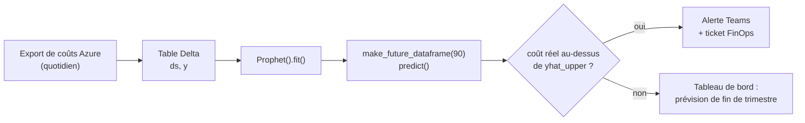

Ce matin, en préparant un travail pour mon certificat en science des données à la TÉLUQ, je suis retombé sur un nom que je croise depuis des semaines dans les notebooks Kaggle sans jamais m'arrêter : Prophet. Le nom m'agaçait un peu, honnêtement. Un outil de prévision qui s'appelle « prophète », lancé par Facebook, ça sent le marketing. J'ai passé vingt-cinq ans à automatiser de l'infrastructure ; je me méfie de tout ce qui promet de prédire.

Puis j'ai lu le README. Deux paragraphes plus tard, j'avais un terminal ouvert.

Ce billet est mon journal de la journée : ce que j'ai compris, ce qui m'a surpris, les questions qui restent. Les faits techniques viennent de deux sources, le [guide de démarrage](https://facebook.github.io/prophet/docs/quick_start.html) et le [README du dépôt facebook/prophet](https://github.com/facebook/prophet), citées à la fin. Le reste est mon opinion de gars d'infra qui apprend la data science un soir à la fois.

## Pourquoi Prophet, pourquoi aujourd'hui

Deux raisons. La scolaire : la prévision de séries temporelles est le premier sujet de mon parcours où le temps n'est pas juste une colonne parmi d'autres. Dans un problème de classification comme [Titanic](/portfolio/titanic-kaggle-soumission-robuste/), l'ordre des lignes ne veut rien dire. Dans une série temporelle, l'ordre *est* l'information.

La professionnelle : mon quotidien est fait de courbes. DBU Databricks, coûts Azure par abonnement, taux d'échec des pipelines. J'ai passé des années à les regarder dans Grafana en faisant, en plissant les yeux, exactement ce que fait un modèle de forecasting : « la semaine prochaine, ça devrait ressembler à ça ». Sans intervalle d'incertitude ni méthode. Je voulais comprendre comment un outil formalise ce réflexe, et pourquoi Kaggle sort Prophet en premier dès qu'il y a une date dans le jeu de données.

## C'est quoi Prophet ?

Le README le dit en une phrase que j'ai relue trois fois :

> Prophet est une procédure de prévision de séries temporelles basée sur un modèle additif où des tendances non linéaires sont ajustées avec des saisonnalités annuelle, hebdomadaire et quotidienne, plus des effets de jours fériés.

Le mot important, c'est **additif**. La prévision est une somme : une tendance, plus des saisonnalités, plus des jours spéciaux, et chaque morceau se regarde séparément. C'est une architecture avant d'être une formule.

Le README précise que Prophet fonctionne mieux avec des séries à forts effets saisonniers et plusieurs saisons d'historique, qu'il est robuste aux données manquantes et aux changements de tendance, et qu'il gère généralement bien les valeurs aberrantes. En langage d'ops : des métriques de production, avec leurs trous de collecte et leurs migrations qui cassent la courbe.

Publié en logiciel libre par l'équipe Core Data Science de Facebook, avec un billet de lancement en 2017 et un article de Sean J. Taylor et Benjamin Letham, *Forecasting at scale* (*The American Statistician*, 2018), Prophet est offert sur PyPI et sur CRAN, sous licence MIT, en Python et en R.

Pourquoi il est populaire, je l'ai compris en dix lignes de code : il suit l'API de scikit-learn. On instancie, on appelle `fit`, on appelle `predict`. Prophet a fait pour le forecasting ce que Terraform a fait pour le provisionnement : remplacer une procédure par une déclaration.

## Les concepts que j'ai découverts aujourd'hui

### La prévision de séries temporelles

Une série temporelle, c'est une mesure répétée dans le temps : un coût par jour, des visites par heure. Prophet veut exactement ça : un dataframe à deux colonnes, `ds` pour la date (YYYY-MM-DD, ou YYYY-MM-DD HH:MM:SS pour un horodatage) et `y` pour la valeur numérique à prévoir. Rien d'autre.

L'exemple du guide est le logarithme des pages vues quotidiennes de l'article Wikipédia de Peyton Manning, quart-arrière de la NFL, choisi parce qu'il montre plusieurs saisonnalités, des taux de croissance qui changent et des journées spéciales comme les matchs éliminatoires et le Super Bowl. Du trafic web, autrement dit.

### La tendance

La tendance, c'est la direction de fond une fois les oscillations enlevées. Le README insiste : les tendances sont non linéaires et le modèle est robuste aux changements de tendance ; le changelog mentionne un paramètre pour fixer la plage des points de changement potentiels (v0.3). Prophet ne suppose donc pas que la courbe continue sagement dans la même direction ; il cherche où la pente a changé. En infrastructure, ces points ont tous un nom : la migration de mars, l'activation de l'autoscaling. Voir un modèle les détecter sans que je les annote m'a fait sourire.

### Les saisonnalités multiples

Le concept qui m'a le plus appris. Une série d'affaires n'a pas *une* saisonnalité, elle en a plusieurs, empilées : la semaine, l'année et, pour les données horaires, la journée. `plot_components` affiche par défaut la tendance, la saisonnalité annuelle et la saisonnalité hebdomadaire, plus les jours fériés si on en a fournis. Le changelog ajoute des saisonnalités personnalisées et les données sous-quotidiennes (v0.2), la saisonnalité multiplicative (v0.3) et des saisonnalités conditionnelles (v0.5), notées avec un point d'interrogation pour un autre soir.

### Jours fériés et événements spéciaux

Le Super Bowl n'est ni une tendance ni une saisonnalité : c'est un événement à date irrégulière qui fait sauter la courbe. Prophet a une notion de jours fériés et d'événements spéciaux pour ça, arrivée en v0.4 ; depuis la v1.1.4, les jours fériés par pays s'appuient sur le paquet Python `holidays`. Les « jours fériés » d'un système, ce sont les fenêtres de maintenance, les clôtures de fin de mois, les jours de paie : des événements connus d'avance qu'on n'a aucune raison de laisser le modèle deviner.

### Croissance linéaire et non linéaire

Le README parle de tendances non linéaires ; le changelog, d'un modèle Stan unifié pour « les deux types de tendance » (v0.3), de minimums saturants (v0.2) et d'une croissance « plate » (v0.7). Je comprends trois régimes : une croissance qui continue, une qui plafonne, et pas de croissance du tout. Le plafond m'intéresse : une capacité de cluster ne monte pas à l'infini, et une droite projetée vers le ciel raconte n'importe quoi au-delà de quelques mois.

### La simplicité d'utilisation

Le guide de démarrage tient en quatre appels :

```python
from prophet import Prophet

m = Prophet()                 # les réglages se passent au constructeur
m.fit(df)                     # df : colonnes ds et y - « 1 à 5 secondes »
future = m.make_future_dataframe(periods=365)
forecast = m.predict(future)  # yhat, yhat_lower, yhat_upper + composantes
```

`make_future_dataframe` prolonge le calendrier du nombre de périodes demandé et inclut par défaut l'historique. `predict` retourne `yhat`, la prévision, `yhat_lower` et `yhat_upper`, les bornes de l'intervalle d'incertitude, plus une colonne par composante. `plot` et `plot_components` dessinent tout ça ; `help(Prophet)` documente le reste.

## Ce qui m'a particulièrement marqué

Honnêtement, ce qui m'a marqué n'est pas la statistique. C'est à quel point Prophet ressemble aux outils que j'utilise depuis vingt ans.

**Il est déclaratif.** Je ne dis pas à Prophet *comment* calculer la saisonnalité ; je lui dis qu'il y en a une, et il s'occupe des séries de Fourier dans le sous-sol. C'est le contrat de Terraform ou d'Ansible : décrire l'état voulu, laisser l'outil converger. La v1.1.5 a même ajouté `preprocess()`, une méthode dont le seul but est de montrer le prétraitement avant que les données n'arrivent au modèle Stan. Un *plan* avant l'*apply*.

**L'intervalle d'incertitude est un seuil d'alerte.** J'ai passé ma carrière à configurer des alertes à seuil fixe : plus de 80 % de CPU, plus de tant de dollars par jour. Des seuils qui sonnent le lundi matin parce que le lundi matin est toujours plus chargé, et qui se taisent le samedi quand il y a un vrai problème. `yhat_upper`, c'est un seuil qui connaît le jour de la semaine. J'ai eu envie de réécrire la moitié de mes règles d'alerte.

**Le changelog se lit comme un `git log` de dix ans.** v0.1 en février 2017, les régresseurs externes la même année, les jours fériés en 2018, `fbprophet` devenu `prophet` en 2021, cmdstan en 2022. Puis la v1.4.0, le 1er août 2026, et juste au-dessus, la note qui m'a le plus surpris de la journée :

> **Mise à jour 2026 :** Prophet est en mode maintenance depuis la v1.4.0. Seuls les correctifs, les mises à jour de dépendances et les changements de parité du paquet R seront acceptés. Aucune nouvelle fonctionnalité n'est prévue.

Ma première réaction a été la déception. La deuxième, la reconnaissance. Un logiciel qui se déclare *fini*, qui suit encore pandas 3 et numpy 2.4 (v1.3.0, janvier 2026) mais qui ne bougera plus l'API, c'est un cadeau pour qui doit le faire tourner cinq ans en production. J'ai écrit ailleurs sur [un système de quarante-neuf ans encore en service](/blog/2026/07/the-oldest-system-in-production/). La stabilité est une fonctionnalité ; il faut juste savoir que c'est celle-là qu'on achète.

## Exemple concret : prévoir des coûts Azure Databricks

Le scénario que je connais le mieux. Chaque jour, une plateforme Databricks coûte un montant qui dépend du jour de la semaine (les pipelines roulent moins la fin de semaine), du moment de l'année (l'été est tranquille, la clôture annuelle ne l'est pas), de la tendance (des équipes migrent, du FinOps nettoie) et d'événements ponctuels (la fin de mois).

J'ai généré deux ans de coûts quotidiens **synthétiques** qui reproduisent ces effets, avec environ 2 % de journées manquantes et une journée aberrante à 2 600 $ au-dessus de la normale. Puis j'ai suivi le guide à la lettre, sans toucher un seul paramètre :

```python
import pandas as pd
from prophet import Prophet

df = pd.read_csv("databricks_cost_daily.csv")   # colonnes ds, y (en $ CA / jour)

m = Prophet()
m.fit(df)                                       # 746 lignes - moins d'une seconde ici

future = m.make_future_dataframe(periods=90)
forecast = m.predict(future)
forecast[["ds", "yhat", "yhat_lower", "yhat_upper"]].tail()
```

| ds | yhat | yhat_lower | yhat_upper |
|:---|---:|---:|---:|
| 2026-12-20 (dim) | 2 389 | 2 181 | 2 575 |
| 2026-12-21 (lun) | 3 036 | 2 850 | 3 234 |
| 2026-12-22 (mar) | 3 075 | 2 883 | 3 265 |
| 2026-12-23 (mer) | 3 052 | 2 861 | 3 254 |
| 2026-12-24 (jeu) | 3 056 | 2 870 | 3 252 |

Le dimanche 20 décembre est prévu environ 650 $ sous le lundi 21. Le modèle a appris la fin de semaine tout seul. Et les composantes, redessinées dans le style de la maison :

[](/assets/img/prophet/prophet-components-fr.svg)

*Données synthétiques ; composantes réelles de Prophet 1.4.0, réglages par défaut. Cliquer pour agrandir.*

Trois choses que le graphique m'a apprises :

**La tendance a trouvé mes deux cassures.** J'avais planté un changement de pente en juin 2025 (nouvelles charges) et un autre en mars 2026 (autoscaling). Les deux sont là, sans annotation de ma part, le second visible comme un plateau.

**La saisonnalité hebdomadaire est presque exactement celle que j'avais cachée dans les données.** Lundi +181 $, mardi +221 $, samedi -458 $, dimanche -468 $.

**Le pic aberrant de novembre 2025 n'a pas tordu la prévision.** `yhat` passe en dessous sans broncher. « Gère généralement bien les valeurs aberrantes », disait le README. J'ai vu.

Une leçon imprévue : ma première version commençait en octobre 2024, un peu moins de deux années complètes, et la composante annuelle n'apparaissait tout simplement pas. En reculant le début au 1er septembre, elle est apparue. « Plusieurs saisons d'historique », disait le README. C'était littéral.

En entreprise, le pipeline que j'imagine est court :



Le réentraînement est trivial : une seconde. Le vrai travail est en amont : un export propre, une table `ds`/`y` fiable, et la liste des jours de clôture à déclarer comme événements spéciaux plutôt que de les laisser gonfler l'intervalle d'incertitude. Du DataOps, autrement dit.

## Les limites que j'ai identifiées

Prophet n'est pas magique, et le README le dit en creux : il *fonctionne mieux* avec de fortes saisonnalités et plusieurs saisons d'historique. Une série de six mois, une métrique sans rythme hebdomadaire, un signal dominé par des événements imprévisibles : ce n'est pas son terrain, et rien ne me dit qu'il y ferait mieux qu'une moyenne mobile bien choisie.

L'API prend un dataframe `ds`/`y`. Une série à la fois. Pour mes coûts par abonnement, ça va ; pour des milliers de séries, il faudra boucler, paralléliser, et accepter que chaque modèle ignore ce que les autres savent. Je soupçonne que c'est là que les approches globales prennent le dessus. Une intuition, pas une mesure.

Côté exploitation, le paquet embarque un modèle Stan compilé via cmdstan ; le README recommande au moins 4 Go de mémoire pour l'installer sur une VM Linux et 2 Go pour l'utiliser. Pas une dépendance légère.

Enfin, le mode maintenance : si le prochain besoin est une fonctionnalité qui n'existe pas encore, elle n'arrivera pas. Savoir *quand* aller voir ailleurs, je ne l'ai pas encore appris.

## Ce que je veux apprendre ensuite

**La validation croisée de Prophet.** Le changelog parle d'une fonction de validation croisée (v0.2), de métriques d'erreur (v0.3) et de métriques personnalisées (v1.1.7). Après [ma mésaventure Titanic](/portfolio/titanic-kaggle-soumission-robuste/), où une validation locale convaincante m'a mené droit dans le mur, je veux comprendre comment on valide honnêtement une prévision quand on n'a pas le droit de mélanger les lignes.

**Comparer.** ARIMA d'abord, la méthode statistique classique de mon cours, pour comprendre ce que Prophet a choisi de ne pas faire. XGBoost ensuite : j'ai [écrit sur quarante ans de victoires des arbres](/blog/2026/08/forty-years-of-losing-to-a-tree/), et transformer une série en table de retards pour la donner à un booster est partout sur Kaggle. Les LSTM enfin, pour voir ce que le deep learning apporte, ou pas, sur une série de coûts.

**Pratiquer sur Kaggle.** Quatre terrains de jeu repérés :

| Kaggle | Pourquoi ça se prête à Prophet |
|:---|:---|
| [Store Sales - Time Series Forecasting](https://www.kaggle.com/competitions/store-sales-time-series-forecasting) | Ventes quotidiennes d'épicerie, avec un fichier de jours fériés et d'événements fourni. |
| [Web Traffic Time Series Forecasting](https://www.kaggle.com/competitions/web-traffic-time-series-forecasting) | Pages vues quotidiennes d'articles Wikipédia : la même nature de données que l'exemple Peyton Manning. |
| [Hourly Energy Consumption](https://www.kaggle.com/datasets/robikscube/hourly-energy-consumption) | Consommation électrique horaire : données sous-quotidiennes, et un clin d'œil à mon employeur. |
| [M5 Forecasting - Accuracy](https://www.kaggle.com/competitions/m5-forecasting-accuracy) | Des dizaines de milliers de séries hiérarchiques : là où l'approche une-série-à-la-fois va montrer ses limites. |

## Conclusion

Une prévision Prophet est une somme lisible : tendance, saisonnalités, jours spéciaux. L'entrée est un dataframe à deux colonnes ; la sortie, une prévision avec ses bornes et chaque composante à côté. L'outil est déclaratif, rapide, robuste aux trous et aux pics, et officiellement fini : sa force et sa limite.

Surtout, pour la première fois depuis le début de ce certificat, un outil de machine learning m'a paru *familier* : un contrat d'entrée clair, un plan avant l'exécution, des composantes qu'on inspecte une à une.

Si vous avez une courbe que vous regardez chaque semaine en plissant les yeux, faites `pip install prophet`, donnez-lui deux ans d'historique et regardez `plot_components`. Vous allez apprendre quelque chose sur votre système. Ce soir, j'ai appris que mes coûts ont une fin de semaine.

Et vous, quelle série temporelle aimeriez-vous décomposer en premier ? Les commentaires sont ouverts.

## Références

1. Facebook Open Source. *Prophet - Quick Start*. Documentation officielle. [https://facebook.github.io/prophet/docs/quick_start.html](https://facebook.github.io/prophet/docs/quick_start.html)
2. Facebook Open Source. *facebook/prophet : Automatic Forecasting Procedure*. Dépôt GitHub - README, notes de version et licence MIT ; cite Taylor, S. J. et Letham, B. (2018), *Forecasting at scale*, The American Statistician, 72(1), 37-45. [https://github.com/facebook/prophet](https://github.com/facebook/prophet)
