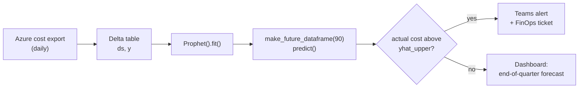

This morning, while working on an assignment for my data science certificate at TÉLUQ, I ran into a name I had been scrolling past in Kaggle notebooks for weeks without ever stopping: Prophet. The name annoyed me a little, honestly. A forecasting tool called "prophet," launched by Facebook, smells like marketing. I have spent twenty-five years automating infrastructure; I distrust anything that promises to predict.

Then I read the README. Two paragraphs later, I had a terminal open.

This post is my journal of the day: what I understood, what surprised me, the questions that are still open. Every technical claim comes from two sources, the [Quick Start guide](https://facebook.github.io/prophet/docs/quick_start.html) and the [README of the facebook/prophet repository](https://github.com/facebook/prophet), cited at the end. The rest is the opinion of an infrastructure guy learning data science one evening at a time.

## Why Prophet, why today

Two reasons. The academic one: time series forecasting is the first subject in my program where time is not just another column. In a classification problem like [Titanic](/portfolio/titanic-kaggle-robust-submission/), the order of the rows means nothing. In a time series, the order *is* the information.

The professional one: my day job is made of curves. Databricks DBU consumption, Azure costs per subscription, pipeline failure rates. I have spent years staring at them in Grafana and doing, by squinting, exactly what a forecasting model does: "next week should look roughly like this." Without an uncertainty interval, without a method. I wanted to understand how a tool formalizes that reflex, and why Kaggle reaches for Prophet first the moment a dataset contains a date.

## What is Prophet?

The README says it in one sentence I read three times:

> Prophet is a procedure for forecasting time series data based on an additive model where non-linear trends are fit with yearly, weekly, and daily seasonality, plus holiday effects.

The important word is **additive**. The forecast is a sum: a trend, plus seasonalities, plus special days, and each piece can be inspected on its own. That is an architecture before it is a formula.

The README adds that Prophet works best with time series that have strong seasonal effects and several seasons of historical data, that it is robust to missing data and shifts in the trend, and that it typically handles outliers well. In ops language: production metrics, with their collection gaps and the migrations that break the curve.

Released as open source by Facebook's Core Data Science team, with a launch blog post in 2017 and a paper by Sean J. Taylor and Benjamin Letham, *Forecasting at scale* (*The American Statistician*, 2018), Prophet is available on PyPI and CRAN under the MIT license, in Python and in R.

Why it is popular, I understood in ten lines of code: it follows the scikit-learn API. You instantiate, you call `fit`, you call `predict`. Prophet did for forecasting what Terraform did for provisioning: it replaced a procedure with a declaration.

## The concepts I discovered today

### Time series forecasting

A time series is a measurement repeated over time: a cost per day, visits per hour. Prophet wants exactly that: a dataframe with two columns, `ds` for the date (YYYY-MM-DD, or YYYY-MM-DD HH:MM:SS for a timestamp) and `y` for the numeric value to forecast. Nothing else.

The guide's example is the log of daily page views for Peyton Manning's Wikipedia page, the NFL quarterback, chosen because it shows multiple seasonality, changing growth rates, and special days such as playoff games and the Super Bowl. Web traffic, in other words.

### Trend

The trend is the underlying direction once the oscillations are removed. The README insists on two things: trends are non-linear, and the model is robust to shifts in the trend; the changelog mentions a parameter to set the range of potential changepoints (v0.3). So Prophet does not assume the curve keeps politely going the same way; it looks for where the slope changed. In infrastructure, those points all have names: the March migration, the day autoscaling was turned on. Watching a model find them without my annotating anything made me smile.

### Multiple seasonalities

The concept that taught me the most. A business series does not have *one* seasonality, it has several, stacked: the week, the year and, for hourly data, the day. By default `plot_components` shows the trend, the yearly seasonality and the weekly seasonality, plus holidays if you supplied any. The changelog adds custom seasonalities and sub-daily data (v0.2), multiplicative seasonality (v0.3) and conditional seasonalities (v0.5), which I wrote down with a question mark for another evening.

### Holidays and special events

The Super Bowl is neither a trend nor a seasonality: it is an event on an irregular date that makes the curve jump. Prophet has a notion of holidays and special events for that, added in v0.4; since v1.1.4, country holidays rely on the Python `holidays` package. The "holidays" of a system are maintenance windows, month-end closes, paydays: events known in advance that there is no reason to make the model guess.

### Linear and non-linear growth

The README talks about non-linear trends; the changelog, about a unified Stan model for "both trend types" (v0.3), saturating minimums (v0.2) and a "flat" growth option (v0.7). I read that as three regimes: growth that keeps going, growth that hits a ceiling, and no growth at all. The ceiling is the one I care about: cluster capacity does not climb to infinity, and a straight line projected into the sky is nonsense past a few months.

### Simplicity of use

The Quick Start fits in four calls:

```python
from prophet import Prophet

m = Prophet()                 # settings go into the constructor
m.fit(df)                     # df: columns ds and y - "1 to 5 seconds"
future = m.make_future_dataframe(periods=365)
forecast = m.predict(future)  # yhat, yhat_lower, yhat_upper + components
```

`make_future_dataframe` extends the calendar by the requested number of periods and includes the history by default. `predict` returns `yhat`, the forecast, `yhat_lower` and `yhat_upper`, the bounds of the uncertainty interval, plus one column per component. `plot` and `plot_components` draw all of it, `plot_plotly` makes it interactive if you install plotly 4.0 or later separately, and `help(Prophet)` documents the rest.

## What struck me most

Honestly, what struck me was not the statistics. It was how much Prophet resembles the tools I have used for twenty years.

**It is declarative.** I do not tell Prophet *how* to compute seasonality; I tell it there is one, and it handles the Fourier series in the basement. That is the Terraform and Ansible contract: describe the desired state, let the tool converge. Version 1.1.5 even added `preprocess()`, a method whose only purpose is to show the pre-processing steps before the data reaches the Stan model. A *plan* before the *apply*.

**The uncertainty interval is an alert threshold.** I have spent my career configuring fixed-threshold alerts: more than 80 percent CPU, more than so many dollars a day. Thresholds that fire on Monday morning because Monday morning is always busier, and stay quiet on Saturday when something is actually wrong. `yhat_upper` is a threshold that knows what day of the week it is. I wanted to rewrite half my alert rules on the spot.

**The changelog reads like a ten-year `git log`.** v0.1 in February 2017, extra regressors the same year, holidays in 2018, `fbprophet` renamed `prophet` in 2021, cmdstan in 2022. Then v1.4.0 on August 1, 2026, and right above it, the note that surprised me most all day:

> **2026 Update:** Prophet is in maintenance mode as of v1.4.0. Only bug fixes, dependency bumps, and changes to the R package to meet parity with Python will be accepted. No new features are planned.

My first reaction was disappointment. My second was gratitude. Software that declares itself *finished*, that still tracks pandas 3 and numpy 2.4 (v1.3.0, January 2026) but will not move the API again, is a gift to anyone who has to run it in production for five years. I have written elsewhere about [a forty-nine-year-old system still in service](/blog/2026/07/the-oldest-system-in-production/). Stability is a feature; you just have to know that it is the one you are buying.

## A concrete example: forecasting Azure Databricks costs

The scenario I know best. Every day, a Databricks platform costs an amount that depends on the day of the week (production pipelines run less on weekends), the time of year (summer is quiet, year-end close is not), the trend (teams migrate in, FinOps cleans up) and one-off events (month-end).

I generated two years of **synthetic** daily costs reproducing those effects, with about 2 percent of days missing and one outlier day 2,600 dollars above normal. Then I followed the guide to the letter, without touching a single parameter:

```python
import pandas as pd
from prophet import Prophet

df = pd.read_csv("databricks_cost_daily.csv")   # columns ds, y (CAD / day)

m = Prophet()
m.fit(df)                                       # 746 rows - under a second here

future = m.make_future_dataframe(periods=90)
forecast = m.predict(future)
forecast[["ds", "yhat", "yhat_lower", "yhat_upper"]].tail()
```

| ds | yhat | yhat_lower | yhat_upper |
|:---|---:|---:|---:|
| 2026-12-20 (Sun) | 2,389 | 2,181 | 2,575 |
| 2026-12-21 (Mon) | 3,036 | 2,850 | 3,234 |
| 2026-12-22 (Tue) | 3,075 | 2,883 | 3,265 |
| 2026-12-23 (Wed) | 3,052 | 2,861 | 3,254 |
| 2026-12-24 (Thu) | 3,056 | 2,870 | 3,252 |

Sunday, December 20 is forecast about 650 dollars below Monday the 21st. The model learned the weekend on its own. And the components, redrawn in the house style:

[](/assets/img/prophet/prophet-components-en.svg)

*Synthetic data; real components from Prophet 1.4.0, default settings. Click to enlarge.*

Three things the chart taught me:

**The trend found both of my breaks.** I had planted a slope change in June 2025 (new workloads) and another in March 2026 (autoscaling). Both are there, without any annotation from me, the second one visible as a plateau.

**The weekly seasonality is almost exactly the one I hid in the data.** Monday +181, Tuesday +221, Saturday -458, Sunday -468 dollars.

**The November 2025 outlier did not bend the forecast.** `yhat` passes underneath without flinching. "Typically handles outliers well," said the README. I have now seen it.

An unplanned lesson: my first version started in October 2024, a little under two full years, and the yearly component simply did not appear in the output. Moving the start back to September 1, it showed up. "Several seasons of historical data," the README also said. It was literal.

The pipeline I picture is short:



Retraining is trivial: one second. The real work is upstream: a clean export, a reliable `ds`/`y` table, and the list of closing days to declare as special events rather than letting them inflate the uncertainty interval. DataOps, in other words.

## The limits I identified

Prophet is not magic, and the README says so between the lines: it *works best* with strong seasonality and several seasons of history. A six-month series, a metric with no weekly rhythm, a signal dominated by unpredictable events: that is not its home turf, and nothing tells me it would beat a well-chosen moving average there.

The API takes a `ds`/`y` dataframe. One series at a time. For my costs per subscription, fine; for thousands of series, you will loop, parallelize, and accept that each model knows nothing of what the others learned. I suspect that is where global approaches take over. An intuition, not a measurement.

Operationally, the package ships a Stan model compiled through cmdstan; the README recommends at least 4 GB of memory to install it on a Linux VM and 2 GB to use it. Not a lightweight dependency.

Finally, maintenance mode: if the next need is a feature that does not exist yet, it is not coming. Knowing *when* to look elsewhere is precisely what I have not learned yet.

## What I want to learn next

**Prophet's cross-validation.** The changelog mentions a cross-validation function (v0.2), error metrics (v0.3) and custom performance metrics (v1.1.7). After [my Titanic misadventure](/portfolio/titanic-kaggle-robust-submission/), where a convincing local validation drove me straight into a wall, I want to understand how you honestly validate a forecast when you are not allowed to shuffle the rows.

**Compare.** ARIMA first, the classical statistical method my course covers, to understand what Prophet chose not to do. XGBoost next: I have [written about forty years of tree victories](/blog/2026/08/forty-years-of-losing-to-a-tree/), and turning a series into a table of lags to feed a booster is everywhere on Kaggle. LSTMs last, to see what deep learning adds, or does not, on a cost series.

**Practice on Kaggle.** Four playgrounds spotted:

| Kaggle | Why it suits Prophet |
|:---|:---|
| [Store Sales - Time Series Forecasting](https://www.kaggle.com/competitions/store-sales-time-series-forecasting) | Daily grocery sales, with a holidays and events file provided. |
| [Web Traffic Time Series Forecasting](https://www.kaggle.com/competitions/web-traffic-time-series-forecasting) | Daily page views of Wikipedia articles: the same kind of data as the Peyton Manning example. |
| [Hourly Energy Consumption](https://www.kaggle.com/datasets/robikscube/hourly-energy-consumption) | Hourly electricity consumption: sub-daily data, and a nod to my employer. |
| [M5 Forecasting - Accuracy](https://www.kaggle.com/competitions/m5-forecasting-accuracy) | Tens of thousands of hierarchical series: where the one-series-at-a-time approach will show its limits. |

## Conclusion

A Prophet forecast is a readable sum: trend, seasonalities, special days. The input is a two-column dataframe; the output is a forecast with its bounds and every component beside it. The tool is declarative, fast, robust to gaps and spikes, and officially finished: its strength and its limit.

Above all, for the first time since I started this certificate, a machine learning tool felt *familiar*: a clear input contract, a plan before execution, components you can inspect one at a time.

If there is a curve you squint at every week, run `pip install prophet`, give it two years of history and look at `plot_components`. You will learn something about your system. Tonight, I learned that my costs have a weekend.

What time series would you decompose first? The comments are open.

## References

1. Facebook Open Source. *Prophet - Quick Start*. Official documentation. [https://facebook.github.io/prophet/docs/quick_start.html](https://facebook.github.io/prophet/docs/quick_start.html)
2. Facebook Open Source. *facebook/prophet: Automatic Forecasting Procedure*. GitHub repository - README, release notes and MIT license; cites Taylor, S. J. and Letham, B. (2018), *Forecasting at scale*, The American Statistician, 72(1), 37-45. [https://github.com/facebook/prophet](https://github.com/facebook/prophet)
